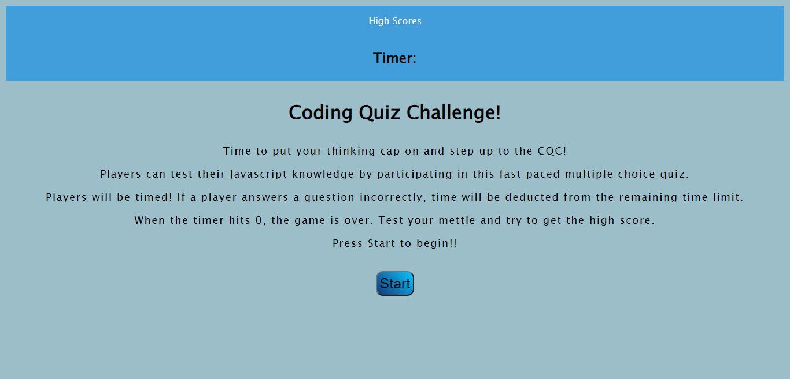

# Quiz Code Challenge!!!

## Description
Provide a short description explaining the what, why, and how of your project. Use the following questions as a guide:
- In order to test our knowledge of hmtl/css/js, we have constructed a Coding Quiz Game.
- Leveraging the newest activities in Unit 4, we can add functionality to our app using DOM traversal, Attributes, Interval Timers, Event Listeners, Keyboard Events, Custom Data Attributes and Local Storage procedures.

## Table of Contents (Optional)
If your README is long, add a table of contents to make it easy for users to find what they need.
- [Installation](#installation)
- [Usage](#usage)
- [Credits](#credits)
- [License](#license)
## Installation
The only required equipment neceesary to play are a web-broser and internet connection.
## Usage
- Players can test their Javascript knowledge by participating in this fast paced multiple choice quiz. Players will be timed! If a player answers a question incorrectly, time will be deducted from the remaining time limit. When the timer hits 0, the game is over. Test your mettle and try to get the high score. Press Start to begin!!
    

    
## Credits
-
-
-
-
## License
The last section of a high-quality README file is the license. This lets other developers know what they can and cannot do with your project. If you need help choosing a license, refer to [https://choosealicense.com/](https://choosealicense.com/).
---
